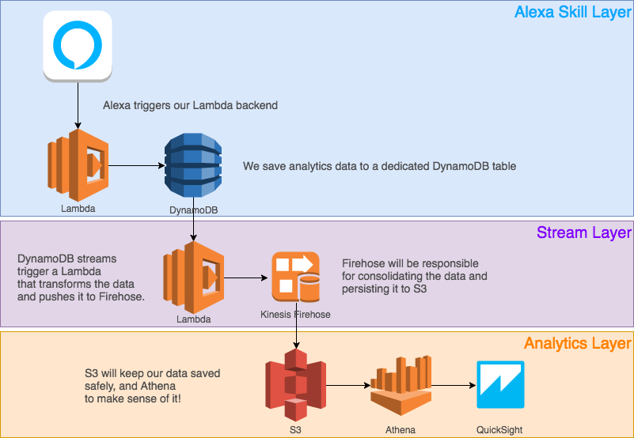

# Alexa Skill Analytics leveraging DynamoDB Streams, AWS Lambda, Kinesis Firehose and Athena.

This aims to be a high-level guide to setup a reporting pipeline for storing analytics data scalably in a Serverless fashion. 

## Component Overview



The overall component overview can be contextually divided across 3 layers:
1. **Alexa Skill Layer**: this is where the skill Lambda / Backend logic lives. This receives requests from the Alexa Service and response back. Interaction is logged using a dedicated DynamoDB table (we will *not* be using the built-in Alexa-SDK table as that is mainly used for saving attributes and should not be used for persisting lots of analytics data)
2. **Stream Layer**: any new Item put into DynamoDB (more in that below) will be part of a DynamoDB stream that triggers a Lambda. This Lambda will unmarshall the data from DynamoDB and convert it to a CSV line. This string is then pushed to Kinesis Firehose to be aggregated in an S3 bucket (our third layer)
3. **Analytics Layer**: once the data is saved to S3 in CSV, we can parse it and use it in any way we want. A very easy way to do it is to use Athena. Athena allows us to import an S3 file into a relational database that we can query easily using standard SQL. 

In the rest of the walkthrough, we will see how to setup each component but we will skip explaining how to create a basic skill. For help on getting started building your first skill, using the following resource: **ADD LINK HERE**.


For the rest of the tutorial, we will use the [Pet Match]() skill tutorial as a reference. We will be logging the following information, for each hit:

```javascript
const analyticsPayload = {
    request_id : this.event.request.requestId, // the request ID sent from the Alexa Service
    user_id : this.event.session.user.userId,  // the user ID sent from the Alexa Service
    api_execution_time : 0,                    // how long, in ms, our API call took in the PetMatch intent handler
    slot_value_animal_resolved: '',            // what slot of type Animal was resolved to
    slot_value_animal_synonym: '',             // what slot of type Animal was actually uttered by the user
    slot_value_animal_is_valid: '',            // whether the uttered slot value is in the interaction model
    slot_value_size_resolved: '',              // what slot of type Size was resolved to
    slot_value_size_synonym: '',               // what slot of type Size was actually uttered by the user
    slot_value_size_is_valid: '',              // whether the uttered slot value is in the interaction model
    slot_value_temperament_resolved: '',       // what slot of type Temperament was resolved to
    slot_value_temperament_synonym: '',        // what slot of type Temperament was actually uttered by the user
    slot_value_temperament_is_valid: '',       // whether the uttered slot value is in the interaction model
    slot_value_energy_resolved: '',            // what slot of type Energy was resolved to
    slot_value_energy_synonym: '',             // what slot of type Energy was actually uttered by the user
    slot_value_energy_is_valid: ''             // whether the uttered slot value is in the interaction model
}
```

## Alexa Skill Layer

All that is needed to setup our Alexa Skill to support the analytics pipeline described above is to create a new DynamoDB table and write, for each time our PetMatch intent is called, an Item in the dedicated table that we will create.

**Steps:**
1. Go to DynamoDB dashboard
2. Got to Tables and click on `Create Table`
3. Set name of the table to be `pet-match-analytics` 
4. Set primary key to be `request_id` [type: string]
5. Create Table
6. In the `Overview` tab, click on `Manage streams` -> Add a new stream
7. Go to triggers, and add a dedicated Lambda. 

To save a new entry in our DynamoDB table, in our Alexa Skill we would write something like this:

```javascript

// ... In the regular Skill code, we would add something like this in the PetMatch handler
const AWS = require('aws-sdk');
const dynamodb = new AWS.DynamoDB.DocumentClient();

const TABLE_NAME = "pet-match-analytics";

dynamodb.put({
    "TableName": TABLE_NAME,
    "Item": analyticsPayload // THE OBJECT DEFINED ABOVE
}, function (err, data) {
    if (err) {
        console.log(err);
    }

    // OTHER LOGIC GOES HERE
    console.log('great success: ' + JSON.stringify(data, null, '  '));
});

// ... rest of skill code
```

### Generate some test data

If instead of updating your skill just yet, you would prefer to follow the tutorial, feel free to generate some test data by using a Lambda function like the below:

```javascript
function randomInt (n) {
    return parseInt(n + Math.random()*n);
}

var animals = [
    'dog',
    'cat'
]

var sizeRes = [
    'large',
    'small',
    'tiny',
    'medium'
]

var size = [
    'large',
    'small',
    'tiny',
    'medium',
    'average',
    'huge',
    'truck',
    'gigantic',
    'scary big',
    'ginormous',
    'ride',
    'waist height',
    'bigger than a cat',
    'on the bed',
    'up to my knees',
    'average',
    'little',
    'take on an airplane',
    'cheap to feed',
    'teacup',
    'pocket',
    'yippy',
    'carry in my purse',
    'put in my pocket',
    'itty bitty'
]

var temperamentRes = [
    "family",
    "guard",
    "watch"
]

var temperament = [
    'calm',
    'active',
    'relaxed',
    'chilled',
    'adult',
    'barks at people',
    'to protect me',
    'protective',
    'is kid friendly',
    'good with kids',
    'family friends',
    'gentle with kids',
    'family',
    'guard',
    'watch'
]

var energyRes = [
    'low',
    'med',
    'high'
];

var energy = [
    'high',
    'medium',
    'low',
    'to cuddle with',
    'to watch netflix with',
    'lazy',
    'for my apartment',
    'fun to play with',
    'tug of war',
    'plays tug of war',
    'that I can run with',
    'play frisbee',
    'run',
    'hike',
    'go hiking',
    'play fetch',
    'energetic',
    'high energy'
]

var bool = [
    0,
    1
]


function randFromArray(arr) {
    return arr[Math.floor(Math.random()*arr.length)];
}


function genRandomAnalytics(n) {
    let array = [];
    while(n--) {
        array.push( {
            PutRequest: {
                Item: {
                    request_id : 'requestid'+ randomInt(10000000000),
                    user_id : 'user'+ randomInt(10000000000),
                    api_execution_time: randomInt(100),
                    slot_value_animal_resolved: randFromArray(animals),
                    slot_value_animal_synonym: randFromArray(animals),
                    slot_value_animal_is_valid: randFromArray(bool),
                    slot_value_size_resolved:  randFromArray(sizeRes),
                    slot_value_size_synonym:  randFromArray(size),
                    slot_value_size_is_valid:  randFromArray(bool),
                    slot_value_temperament_resolved:  randFromArray(temperamentRes),
                    slot_value_temperament_synonym:  randFromArray(temperament),
                    slot_value_temperament_is_valid:  randFromArray(bool),
                    slot_value_energy_resolved:  randFromArray(energyRes),
                    slot_value_energy_synonym:  randFromArray(energy),
                    slot_value_energy_is_valid:  randFromArray(bool)
                }
            }
        });
    }
    
    return array;
}


exports.handler = (event, context, callback) => {

    var params = {
      RequestItems: {
        "pet-match-analytics" : genRandomAnalytics(25) // adds dummy data in batches of 25 (max batch rate)
      }
    };
    
    console.log(params.RequestItems["pet-match-analytics"][0]);
    
    if(event.test) {
        context.succeed('testing...');
        return;
    }
        
    const AWS = require('aws-sdk');
    AWS.config.update({region: 'eu-west-1'});
    
    const dynamodb = new AWS.DynamoDB.DocumentClient();

    dynamodb.batchWrite(params, function(err, data) {
      if (err) context.fail(err);
      else context.succeed('Successfully saved analytics');
    });

};
```

That's it!

### Analytics helper functions

```javascript
function hrtimeToMilliseconds(diff) {
    const NS_PER_SEC = 1e9;
    const NS_PER_MIL = 1e6;
    return (diff[0] * NS_PER_SEC + diff[1]) / NS_PER_MIL;
}

function getCurrentTimestamp() {
    let date = new Date();
    return date.getTime();
}
```

## Stream Layer

Go to DynamoDB and go to `pet-match-analytics`

0. If you haven't already done so, make sure to active streams in the `pet-match-analytics` table (step 6 above). 
1. Go to the tab `Triggers`
2. `Create Trigger` and select `New function`
3. Create a new Lambda function. Below is some sample code to get your started. In this function we are capturing the stream data, unmarshalling it to a standard JSON object and then flattening it to a CSV line string. We make an array for every record and push that to Firehose.

```javascript

var AWS = require('aws-sdk');
var firehose = new AWS.Firehose();
var parse = AWS.DynamoDB.Converter.unmarshall;

exports.handler = function(event, context) {

    var fireHoseInput = [];
    event.Records.forEach((record) => {

        console.log('Dynamo:NewImage', record.dynamodb.NewImage);

        if (record.eventName == "INSERT") {
            console.log('Dynamo:INSERTING...');
            let parsedData = parse(record.dynamodb.NewImage);
            let csv_string = [
                parsedData.request_id,
                parsedData.user_id,
                parsedData.api_execution_time,
                parsedData.slot_value_animal_resolved,
                parsedData.slot_value_animal_synonym,
                parsedData.slot_value_animal_is_valid,
                parsedData.slot_value_size_resolved,
                parsedData.slot_value_size_synonym,
                parsedData.slot_value_size_is_valid,
                parsedData.slot_value_temperament_resolved,
                parsedData.slot_value_temperament_synonym,
                parsedData.slot_value_temperament_is_valid,
                parsedData.slot_value_energy_resolved,
                parsedData.slot_value_energy_synonym,    
                parsedData.slot_value_energy_is_valid    
            ].join(",");
            console.log('Parsed:: ', parsedData)
            fireHoseInput.push({ Data: csv_string + '\n' });
        }
    });
    
    console.log('DynamoFireHoseInput::', JSON.stringify(fireHoseInput));
    
    var params = {
        DeliveryStreamName: 'pet-match-firehose-stream',
        Records: fireHoseInput
    };
    
    firehose.putRecordBatch(params, function (err, data) {
        if (err) {
            console.log('Something went wrong')
            console.log(params)
            console.log(err, err.stack); // an error occurred
        }
        else console.log(data);               // successful response
        
        context.done();
    });
};

```

4. Go to Kinesis, select Firehose Console
5. Create a new Delivery Stream
6. Give it a name. In our case it's `pet-match-firehose-stream`
7. Leave all the defaults
8. Give it an S3 bucket name (create one if you don't have it already). We called ours `pet-match-bucket`. Add a prefix like `analytics-`
9. Make sure Data Transformation is unchecked
10. S3 Buffer Interval should be 60 (sec) -- or whatever is best for your use case
11. Optionally set a TTL expiry date. This makes sure that your DynamoDB data is automatically purged after X amount of time. This is usefull if you are logging massive amounts of data and just need DynamoDB to retain the latest data, whereas the rest can be sent on via streams to S3 for persistent long-term storage.


## Analytics Layer with Athena

We're almost done! What we did in the previous layer by connecting DynamoDB streams to Firehose and outputting them to S3. 
Firehose will generate folders inside the bucket in the following format `PREFIX-YYYY`/`MM`/`DD`/`HH`

Now we will impor the S3 data and load it into Athena in order to manipulate it via SQL. For example we might want to get aggregates by animal type, see average api call processing times, etc. 

1. Open up Athena, and click on Add Table. 
2. Set a database name like `analytics` (a database can have multiple tables)
3. Set a table name like `petmatch` 
4. Add the input of the data source as your s3 bucket name + the path to the first folder. In our case it is: `s3://pet-match-bucket/firehose2017/` (make sure to keep the latest)
5. Click Next
6. In the Data Format, select "CSV"
7. You will need to define headers and types for each column. You can use the Batch Column functionality or add them one by one. In our case, we will use the Bulk add functionality and use the following input: `request_id string, user_id string, api_execution_time int, slot_value_animal_resolved string, slot_value_animal_synonym string, slot_value_animal_is_valid boolean, slot_value_size_resolved string, slot_value_size_synonym string, slot_value_size_is_valid boolean, slot_value_temperament_resolved string, slot_value_temperament_synonym string, slot_value_temperament_is_valid boolean, slot_value_energy_resolved string, slot_value_energy_synonym string, slot_value_energy_is_valid boolean`
8. Optionally, if you are familiar with the SQL format, instead of using the Wizard, you can use the Query Editor directly. The equivalent query command for the above is:

```SQL
    CREATE EXTERNAL TABLE IF NOT EXISTS analytics.petmatch (
    `request_id` string,
    `user_id` string,
    `api_execution_time` bigint,
    `slot_value_animal_resolved` string,
    `slot_value_animal_synonym` string,
    `slot_value_animal_is_valid` tinyint,
    `slot_value_size_resolved` string,
    `slot_value_size_synonym` string,
    `slot_value_size_is_valid` tinyint,
    `slot_value_temperament_resolved` string,
    `slot_value_temperament_synonym` string,
    `slot_value_temperament_is_valid` tinyint,
    `slot_value_energy_resolved` string,
    `slot_value_energy_synonym` string, 
    `slot_value_energy_is_valid` tinyint 
    )
    ROW FORMAT SERDE 'org.apache.hadoop.hive.serde2.lazy.LazySimpleSerDe'
    WITH SERDEPROPERTIES (
    'serialization.format' = ',',
    'field.delim' = ','
    ) LOCATION 's3://pet-match-bucket/analytics-2017/'
    TBLPROPERTIES ('has_encrypted_data'='false');
```

We're done! Now we can write queries to our hearts content and get insights into our data.

## Leveraging Athena

### Queries
Now that we have our data loaded into Athena, we can write queries like the following:

**How many times each animal was requested**
```SQL
SELECT 
  slot_value_animal_resolved as animal, 
  count(slot_value_animal_resolved) as count
FROM petmatch 
GROUP BY 1;
```

**How many times users uttered a base word for each slot instead of a synonym**
```SQL
SELECT 
  temperament,
  CAST(matched AS double) / CAST(count AS double) as synonym_spread
  FROM (
    SELECT 
    slot_value_temperament_resolved as temperament,
    count(slot_value_temperament_resolved) as count,
    sum(case when slot_value_temperament_resolved = slot_value_temperament_synonym then 1 else 0 end) as matched 

    FROM petmatch 
    GROUP BY 1
)
```

If you are not SQL-savvy, you can leverage [QuickSight](https://quicksight.aws/) to quickly make sense of the CSV data!
